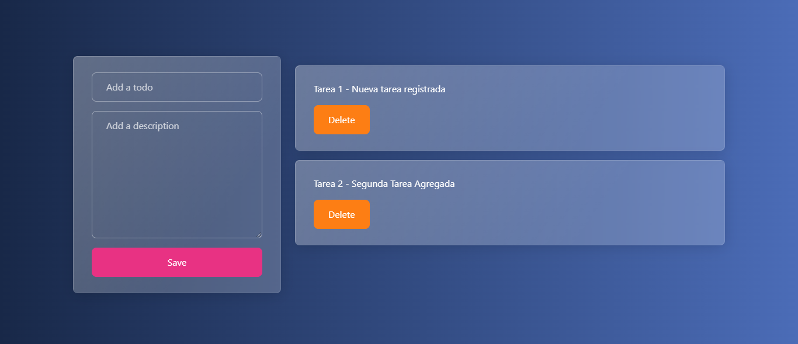

# Tasks app

This application is a simple practice of handling states in vanilla javascript. The app consists of a simple task application where we can add new tasks and delete the tasks already done.

## Technologies

- HTML
- Boostrap
- Javascript

## Process of development

the process for create this app, it was easy the development of struct of code with html and javascript, but hard the part of the implementation of the driving of the state since it was my first time doing this type of logic
